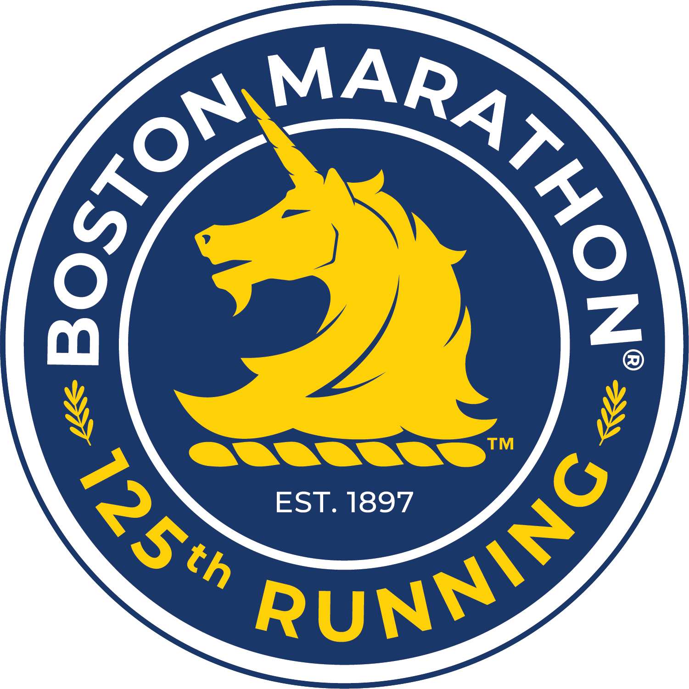

 

 
 

### This project is a retrospective look at the Boston Marathon: its runners, its winners, and its weather. 

Authors: Sydney Musick (sm4993), Suhani Patel (sp3903), Tamara Hofer (th2891), Hugo Wang (xw2757), Claire Mobley (cm4070)

 
 

Outline of the project and website:

<iframe width="560" height="315" src="https://www.youtube.com/embed/rcpCys-JUmk" title="YouTube video player" frameborder="0" allow="accelerometer; autoplay; clipboard-write; encrypted-media; gyroscope; picture-in-picture" allowfullscreen></iframe>

 

Project Repo Links:

* [Website Repo](https://github.com/symusick/bostonmarathon.github.io.git)
* [Working Repo](https://github.com/symusick/p8105_finalproject_marathon.git)

 
 

###### *Note: We do not intend to predict the next winner of the Boston Marathon with this project. The results might be used to inform speculation, not to predict future winners.

